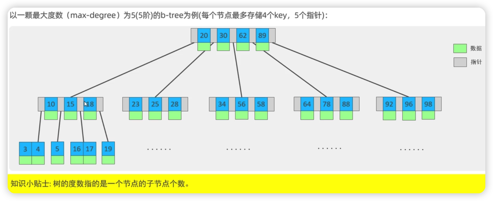

# 索引
> 帮助 MySQL 高效获取数据的数据结构（有序）

优点
* 提高数据检索效率，降低数据库IO成本
* 通过索引对数据进行排序，降低数据排序成本，降低对CPU的消耗

缺点  
* 索引需要占据空间
* 索引降低更新表的速度，对表行进行 INSERT、UPDATE、DELETE 时，效率降低

# 索引结构
|  索引结构 | 说明 | 
| :-----:| :----: |
| B+ Tree | 常见索引 |    
| Hash 索引 | 底层数据结构使用哈希表实现，只有精确匹配缩影列的查询才有效，不支持范围查询 |    
|  R-Tree（空间索引） | MyISAM 引擎的一个特殊索引，主要用于地理空间数据类型 |  
| Full-text（全文索引） | 通过建立倒排索引，快速匹配文档 |  

|  索引结构 | InnoDB |  MyISAM | Memory |
| :-----:| :----: | :----: | :----: |
| B+ Tree | 支持 |   支持 | 支持 | 
| Hash | 不支持 |  不支持 | 支持 | 
| R-Tree | 不支持 |  支持 | 不支持 | 
| Full-text | 5.6 版本后支持 |  支持 | 不支持 | 

# B-Tree 多路平衡查找树
以一颗最大度数（max-degree）为5（5阶）的b-tree为例
（每个节点最多存储4个key，5个指针）


# 数据结构可视化网站
B-Tree 树
https://www.cs.usfca.edu/~galles/visualization/BTree.html

# B-Tree+ 
以一颗最大度数（max-degree）为4阶的 b+ Tree为例


B-Tree 与 B+Tree 区别
1. 所有的数据都会出现在叶子节点
2. 叶子节点形成一个单向链表
3. MySQL 索引结构 在B+Tree树 相邻子节点增加一个指针


# Hash 索引
> 采用 hash 算法，将键值换算成新的hash值，映射到对应的槽位上，然后存储在 hash 表中  
> 出现hash 冲突，可以使用链表解决

1. 只能使用 等值比较 （= in ），不支持范围查询
2. 无法利用索引完成排序
3. 查询效率高，通常一次查询

# 索引分类
|  分类 | 含义 |  特点 | 关键字 |
| :-----:| :----: | :----: | :----: |
| 主键索引 | 针对表中主键创建的索引 |  默认创建爱，只能有一个 | PRIMARY |
| 唯一索引 | 避免同一表中某数据中的重复值 |  可以有多个 | UNIQUE |
| 常规索引 | 快读定位特定数据 |  可以有多个 |  |
| 全文索引 | 全文索引是查找文本中的关键词，而不是比较索引中的值 |  可以有多个 | FULLTEXT | 

# InnoDB 中按索引存储形式 分类
| 分类 | 含义 | 特点 | 
| :-----:| :----: | :----: |
| 聚集索引（Clustered Index） | 将数据存储与索引放到一块，索引结构的叶子节点存储了数据 | 必须有，有且只有一个 |
| 二级索引（Secondary Index） | 将数据与索引分开存储，索引结构的叶子节点关联的是对应的主键 | 可以存在多个 |

聚集索引 规格：  
1. 如果存在主键，则主键索引就是聚集索引
2. 如果不存在主键，将使用第一个唯一（UNIQUE）索引座位聚集索引
   
回表查询：现在二级索引中查询，再到聚集索引中查询，获取数据

# 索引语法
1. 创建索引: 单列索引、联合索引
   ```SQL
   CREATE [UNIQUE|FULLTEXT] INDEX index_name ON table_name (index_col_name);
   ```
2. 查看索引
   ```SQL
   SHOW INDEX FROM table_name;
   ```
3. 删除索引
   ```SQL
   DROP INDEX index_name ON table_name;
   ```

# SQL 性能分析
## SQL 执行频率
```SQL
   SHOW GLOBAL STATUS LIKE 'Com_______';
```

## 慢查询日志
> 记录所有执行时间超过默认参数（long_query_time, 单位秒，默认10秒）的所有查询日志   

查看慢日志记录是否开启
```SQL
   SHOW VARIABLES LIKE 'slow_query_log';
```

MySQL 慢日志默认关闭，开启慢日志方法方法，再配置文件 my.cnf 中配置
```
   # 开启慢日志查询
   slow_query_log = 1
   # 设置慢日志时间为 2 秒，超过记录为慢日志
   long_query_time = 2
```

慢查询日志 linux 日志位置
/var/lib/mysql/localhost-slow.log

## profile 详情
show profile 能够在SQL 优化帮助我们了解耗时
1. 查看当前数据库是否支持 profile 操作
   ```SQL
   SELECT @@profiling;
    ```
2. 设置 profile 打开
   ```SQL
   SET profiling = 1;
    ```
3. 查看每一条 SQL 的耗时基本情况
   ```SQL
   SHOW profiles;
    ```
4. 查看指定 query_id 的 SQL 各个阶段耗时情况
   ```SQL
   SHOW profile for query query_id;
    ```

5. 查看指定 query_id 的 SQL CPU 使用 情况
   ```SQL
   SHOW profile cpu for query query_id;
    ```

## explain 执行计划
> explain 或 desc 获取 mysql 如何执行 SELECT 语句

```SQL
    EXPLAIN SELECT 字段列表 FROM 表名 WHERE 条件;
```
explain 参数
> 重点关注 type possible_key key_len
1. id：select 查询的序列号，表示查询中执行select子句或者是操作表的顺序（id 相同，执行顺序从上到下；id 不同，值越大，越先执行）
2. select_type: 查询类型，SIMPLE（简单表）、PRIMARY（主查询）、UNION（UNION中第二个或者后面的查询语句）、SUBQUERY（SELECT、WHERE之后包括子查询）
3. type：表示访问类型  
   性能由好到差：NULL、system、const、eq_ref、ref、range、index、all
4. possible_key：在这张表中可能用到的索引，一个或者多个
5. key：实际用到的索引
6. key_len：使用到的索引字节数，根据索引字段可能最大长度决定，越短越好
7. rows：执行查询的行数，预估估计值，作参考
8. filltered：返回结果数占需读取行数的百分比，值越大越好

# 索引使用
1. 最左前缀法则 针对联合索引
   * 如果索引引用了多列，要遵循最左前缀法则
   * 最左前缀法则：查询从索引最左列开始，并且不跳过索引中的列
   * 如果跳过某一列，索引将部分失效（后面字段索引失效）
2. 范围查询 针对联合索引
   * 联合索引中，出现范围查询（>, <），范围查询右侧的列 索引失效
  
3. 尽量不要索引列运算
   * 尽量不要在索引列上进行运算操作，索引列将失效

4. 字符串类型需要引号
   * 字符串类型字段使用时，不加引号，索引将会失效

5. 模糊查询
   * 如果尾部模糊匹配，索引不会失效。
   * 如果头部模糊匹配，索引失效。
  
6. or连接条件
   * 用or分割的条件，如果or前的条件中有索引列，而后面没有索引列，则涉及的索引不会被用到

7. 数据分布影响
   * 如果 MySQL 评估使用索引比全表慢，则不使用索引，mysql 自动选择

8. SQL提示
   * 在SQL语句中加入为的提示达到优化操作的目的
   * use index(index_name) 建议使用某个索引
   * ignore index(index_name)  不使用某个索引
   * force index(index_name)  必须使用某个索引
   * 位置 在 from 表名 后填写

9. 覆盖索引
   * 尽量使用覆盖索引（查询使用了索引，并且需要返回的列，在改索引中已经全部能找到），减少select *

10. 前缀索引
   *  将字符串的一部分前缀，建立索引，节约空间、提高索引效率
   ```SQL
   CREATE  INDEX index_name ON table_name ( index_col_name(n ) );
   ```
11. 推荐使用联合索引

# 索引设计原则
1. 针对数据量较大，且查询比较频繁的表建立索引
2. 针对常作为查询条件（where）、排序（order by）、分组（group by）操作的字段建立索引
3. 尽量选择区分度高的列作为索引，尽量建立唯一索引，区分度越高，使用索引效率越高
4. 如果是字符串类型的字段，字段的长度较长，可针对字段的特点，建立前缀索引
5. 尽量使用联合索引，减少单列索引，查询时，联合索引很多时候可覆盖索引，节省存储空间，避免回表
6. 控制索引数量，并不是越多越好，影响增删改的效率
7. 如果索引类不能存储null值，请在创建表时使用 not null 约束。当优化器知道每列是否包含 null 时，可以更好确定哪个索引最有效用于查询