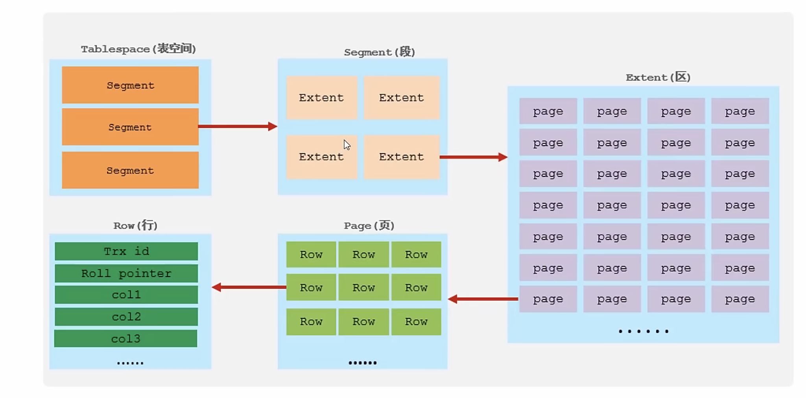

# InnoDB 逻辑存储结构

1. 表空间（ibd 文件）用于存储记录、索引等数据
2. 段：分为数据段、索引段、回滚段，是InnoDB所以组织表
3. 区：表空间的单元结构，每个区大小为1M。默认情况，InnoDB 存储引擎页大小为16K，即一个区中一共有64个连续的页
4. 页：是存储引擎磁盘管理最小单元，每个页大小默认为16KB。InnoDB 每次从磁盘申请 4-5个区
5. 行：InnoDB是按行存放